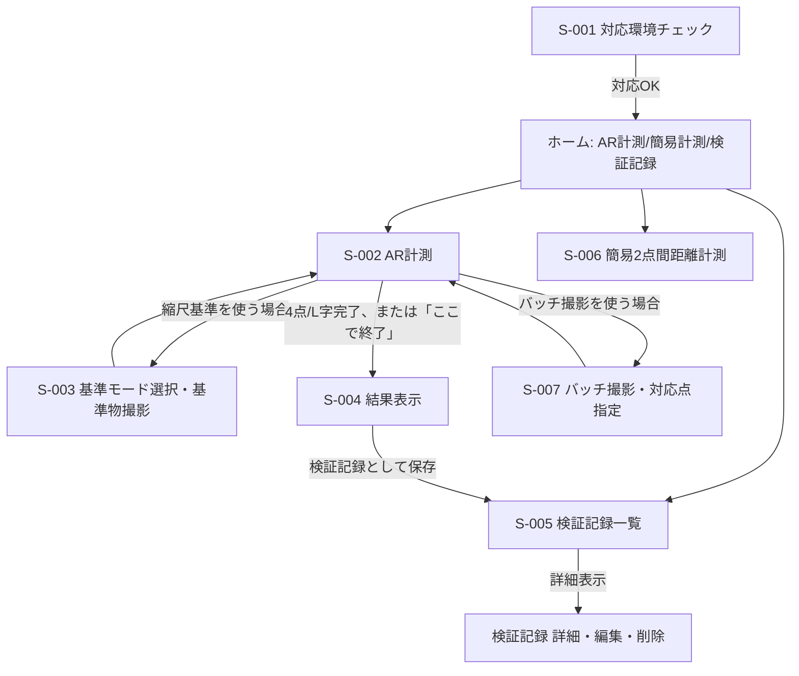

# 画面定義

## デザイントークン

値はモック未作成のため暫定【想定】。実画面ができた時点で見直すタスクは `docs/tasks.md` T-023 に記載。

### フォント

- 本文・見出し共通: `"Noto Sans JP", "Hiragino Sans", "Yu Gothic", "Meiryo", sans-serif` 【想定：モック比較で確定】
- 配信: Google Fonts CDN（`font-display: swap`）
- 使用ウェイト: 400 / 700
- 基準サイズ・行間: 16px / 1.6
- 禁止: `font-family` をOS既定任せ（`sans-serif` のみ）にすること

### アイコン

- ライブラリ: Lucide 【想定：他候補との比較は未実施】
- 形式: SVGコンポーネント
- 基準: サイズ20px、色は現在の文字色に追従
- アイコンのみのボタンには `aria-label` を必須とする

### SIKUMILABブランド表示（要件定義書8.5・15.1で採用確定）

- ヘッダ: 左にアプリアイコン、右にサービス名「ハカルーム」。画面数が7つと少ないため主ナビゲーションは3項目（AR計測／簡易計測／検証記録）に絞る【想定】
- フッタ: `hakaroom-MAJOR.MINOR.PATCH`（`src/version.ts` の `APP_VERSION` を表示）と `© 2026 SIKUMI LAB` を表示

## 画面一覧

| 画面ID | 名称 | 対応機能ID |
|--------|------|-----------|
| S-001 | 対応環境チェック | F-001 |
| S-002 | AR計測（4点／L字記録） | F-002, F-003, F-006, F-007, F-017 |
| S-003 | 基準モード選択・基準物撮影 | F-011, F-012, F-013, F-014, F-015 |
| S-004 | 結果表示（四辺・面積・簡易平面図） | F-004, F-005, F-018 |
| S-005 | 検証記録一覧・詳細 | F-008 |
| S-006 | 簡易2点間距離計測 | F-016 |
| S-007 | バッチ撮影・対応点指定 | F-009, F-010 |

## 画面遷移

## S-001 対応環境チェック

- 表示: WebXR/Hit Test対応可否の判定結果、非対応時の理由（例: 「WebXR非対応のブラウザです」「Google Play開発者サービスが必要です」）
- 操作: 対応OKならホームへ進む。非対応なら対処法を案内し、再チェックボタンを表示
- バリデーション: 該当なし

## S-002 AR計測（4点／L字記録）

- 表示: カメラ映像、床認識状態、記録済み測点（順序付き）、測点の安定性表示（F-017：短時間のばらつきが大きい場合に静止を促す警告）
- 操作:
  - 測点記録（タップ）
  - 1点戻る（直近1点を取消、F-006）
  - 任意測点の選択削除・修正（記録済み測点をタップして選択→削除、F-007）
  - 「ここで終了」（4点/5点以上に満たなくても計測を終了しS-004へ、確定）
  - 追跡ロスト時は「直前まで記録した測点を保持し、基準を取り直して再開」ダイアログを表示（要件定義書7.2）
- バリデーション: 記録済み測点0件で「ここで終了」を選んだ場合は結果画面へ遷移せず警告を表示【想定】

## S-003 基準モード選択・基準物撮影

- 表示: 縮尺基準モード4種（基準なし／メジャー／登録済み基準物／任意基準物）の選択UI、選択後の撮影ガイド枠
- 操作:
  - 登録済み基準物（A4）: 撮影→自動検出結果の輪郭候補を表示→利用者が端点をドラッグ修正→確定（確定前は縮尺計算に使わない、C-03）
  - 任意基準物: 1辺の両端点を画面上でタップ指定→実寸値を入力
  - メジャー: 区間の両端を画面上で指定→実寸値を入力
  - 基準物は複数配置可（同一種類、確定）。配置ごとに「配置1」「配置2」…とラベル表示し、一覧から採用する1件を選べるようにする【想定：統合方法は要件定義書20章No.9で未決】
  - 基準物と対象が非同一平面・異なる角度で撮影された場合は警告を表示し、再撮影を促す（ブロック、確定）
- バリデーション: 確定操作を経ない自動検出結果は「未確定」ラベルを表示し、次の計算に使わせない

## S-004 結果表示（四辺・面積・簡易平面図）

- 表示: 四辺の長さ・周長・面積（生値／補正値／手入力値を切替タブで表示）、簡易平面図（SVG）、実測値入力欄
- 操作:
  - 実測値の入力→検証記録として保存
  - 寸法の手修正（F-018）：辺ごとに手入力値を上書き、生値は保持されたまま別表示
- バリデーション: 実測値は数値のみ、未入力のまま保存した場合は「実測値未入力」として記録する【想定】

## S-005 検証記録一覧・詳細

- 表示: 記録一覧（測定日時・種別・誤差の概要）、詳細画面（実測値・計測値・環境条件・端末情報・寸法値の生/補正/手入力比較）
- 操作: 一覧から詳細へ遷移、詳細画面で実測値・環境条件・メモを編集、個別記録の削除（確定、取り消し不可）
- バリデーション: 削除時は確認ダイアログを表示する【想定】

## S-006 簡易2点間距離計測

- 表示: カメラ映像、2点の記録状況、距離結果
- 操作: 2点記録→距離表示→検証記録として保存（確定）。縮尺基準モード（S-003と共通コンポーネント）を利用可能
- バリデーション: 1点のみの状態で結果表示に進めない

## S-007 バッチ撮影・対応点指定

- 表示: 読み込んだ複数枚の写真のサムネイル一覧、選択した2枚の並べ表示、対応点指定UI
- 操作: 端末のカメラロール等から複数枚の写真を読み込み（AR起動中でなくてもよい、確定）→2枚を選択→同一の実世界の点を両方の画像上でタップ指定→既知距離を1区間指定→WebXR測点との比較・補正に利用（A方式と併用、確定）
- バリデーション: 対応点が2組未満、または幾何条件（床平面・垂直壁・直角）と整合しない場合は警告し再指定を促す
