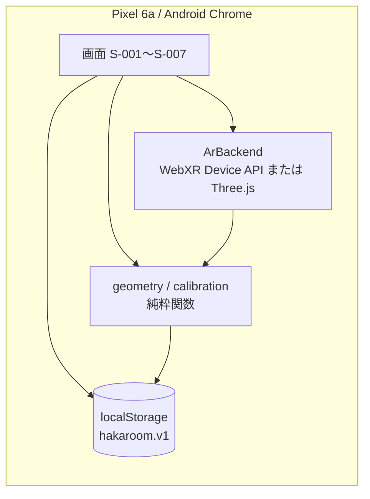

# ハカルーム 基本設計サマリ

## 文書情報

| 項目 | 内容 |
|---|---|
| 版数 | 0.1 |
| 作成日 | 2026-09-23 |
| 元にした要件定義書 | `要件定義書_ハカルーム.md` v0.2 |
| 作成者 | シクミラボ |

## 全体構成

サーバーを持たない静的Webアプリ。GitHub Pagesで配信し、計測データは端末内（localStorage）に閉じる（要件定義書 C-01）。

## 主要な設計判断

| 項目 | 決定 | 理由 | 区分 |
|---|---|---|---|
| フロントエンド構成 | Vite + TypeScript（フレームワークなし） | 画面数が7つと少なく、フレームワーク導入のコストに見合わない | 確定 |
| ARバックエンド | 技術検証で素のWebXR Device APIとThree.jsの両方を試作・比較してから決定 | 精度検証が本プロジェクトの最大の論点のため、実装コストより比較優先 | 確定（比較する方針）／採用方式は【想定：Three.js寄り】 |
| 平面図描画 | 素のSVG | ライブラリ不要な複雑さ | 確定 |
| データ永続化 | localStorage、JSON、`schemaVersion`管理 | サーバーレス方針（C-01）、画像は保存しない方針のため軽量な形式で十分 | 確定 |
| 画像の扱い | 検証記録には保存しない（メタデータのみ） | ユーザー確認により、容量・実装コストを抑える | 確定 |
| データ保持上限 | 検証記録100件、FIFO自動削除 | ユーザー確認による暫定値 | 確定（値は暫定） |
| テスト | Vitest（幾何計算ロジック中心） | 距離・面積計算の正確性がプロジェクトの核心のため重点的にテストする | 確定 |
| ホスティング | GitHub Pages | 個人検証用途で最も手軽 | 確定（要件定義書で決定済み） |
| 実装体制 | Claude Codeで着手し、途中でCodexへ引き継ぎ | ユーザーの作業スタイル | 確定 |
| バージョン | `hakaroom-MAJOR.MINOR.PATCH`、現在 `hakaroom-0.1.0` | 要件定義書15.1の標準提案を採用 | 確定 |
| デザイントークン（フォント・アイコン） | Noto Sans JP系フォールバック／Lucideアイコン | モック未作成のための暫定値 | 【想定】（`docs/tasks.md` T-023でモック比較後に見直し） |
| 基準物の複数配置の統合方法 | 統合はせず、配置ごとの結果を一覧表示し利用者が1件選択 | 統合アルゴリズム（平均化等）は未検討のため、まず比較できる形にする | 【想定】（要件定義書20章 No.9で最終決定） |

## 要件との対応

正典は [`docs/tasks.md`](docs/tasks.md) 冒頭のトレーサビリティ表。要件定義書のF-001〜F-020（20機能）とNF-データ保持／NF-バージョン表示／NF-タイムゾーン／NF-データ非送信の4非機能要件が、それぞれ画面・処理・データ・タスクへ対応付けられている。未対応の機能IDは無い（F-019・F-020は意図的にフェーズ3へ後送り）。

## 実装計画の要点

技術検証（`docs/tasks.md` フェーズ0）を最優先に置いている。これは要件定義書の要確認No.3（WebXR Hit Test/AnchorsのPixel 6a上での挙動）と、ユーザーが希望した「素のWebXR Device APIとThree.jsの両方で検証する」という方針への対応。ここで採用方式（`ArBackend`の実装）を確定してから、フェーズ1（部屋計測コア）→フェーズ2（縮尺基準・補助計測）→フェーズ3（将来機能）の順に進める。

## 残る要確認事項

要件定義書20章の残り10件（GitHub Pages選定・データ保持等、Q&Aで詰めた7件は解消済み）に加え、設計段階で新たに生じたものを含める。

| No | 事項 | 確認先 | 設計影響 |
|---|---|---|---|
| 1 | 実用上の許容誤差・合否基準等（技術検証後） | 開発者本人 | 後で可（`docs/tasks.md` T-003〜T-005の結果を踏まえる） |
| 2 | WebXR Hit Test/AnchorsのPixel 6a上での挙動 | 技術検証（T-003, T-004） | 設計ブロッカー（フェーズ0で解消予定） |
| 3 | 複数配置した基準物の統合方法・配置数上限 | 開発者本人 | 後で可（暫定実装は上記の通り「比較のみ」） |
| 4 | 検証記録の保持上限の具体的な値（暫定100件） | 開発者本人 | 後で可 |
| 5 | 基準物の輪郭自動検出に使うライブラリ（候補: OpenCV.js） | 開発者本人／技術検証 | 後で可（T-013着手前） |
| 6 | デザイントークン（フォント・アイコン）の最終確定 | 開発者本人（モック比較） | 後で可（T-023） |

要件定義書20章に残る他の項目（家具遮蔽時の案内文言、SIKUMILABヘッダ/フッタの画面別詳細等）は、対応する画面タスク（T-007, T-023等）の実装時に決める設計詳細として扱う。
