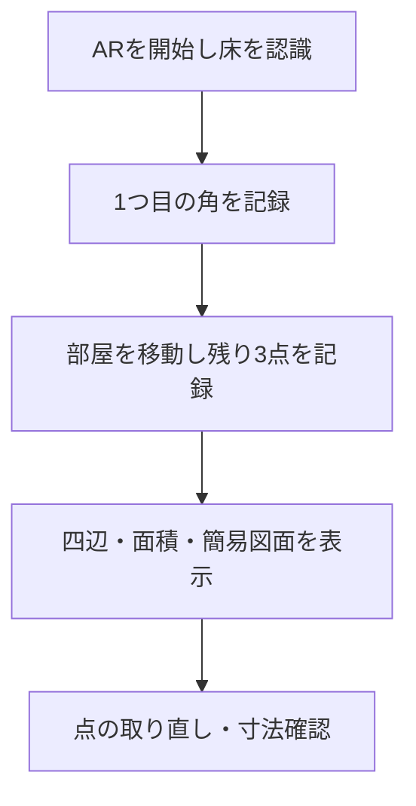

# 構想たたき台: ハカルーム（仮称）— GPSを使わない室内採寸・簡易図面作成Webアプリ

| 作成日 | 作成者 | 状態 | 名称 |
|---|---|---|---|
| 2026-09-15 | シクミラボ | 構想段階（試作・精度検証前） | 【想定】ハカルーム（仮称。正式名称は要件定義で再確認） |

> この資料は、技術検証を始めるための構想たたき台です。【想定】は仮置き、【要確認】は今後決める事項を示します。動作や精度を保証するものではありません。

## 1. 一言でいうと

スマートフォンのブラウザで部屋の角を順番に指定すると、壁の長さ・面積・簡単な平面図を作成できるWebアプリです。GPSや専用アプリのインストールを必要とせず、まずはPixel 6aで「数cm以内の誤差を狙えるか」を実測で確かめます。

仮称「ハカルーム」は、「部屋を測る」用途が直感的に伝わり、検討中の呼び名として使いやすいことから置いています。

## 2. 背景・課題

部屋の寸法や面積を知るには、通常はメジャーやレーザー距離計を使い、測った数値をメモして図面に書き起こします。道具の準備、各辺の測定、数値の転記、面積計算が別々の作業になり、測り忘れや転記ミスも起こり得ます。

そこで、普段使っているスマートフォンだけで採寸から図面化まで進められないか、というのがこの構想の出発点です。ただし、加速度・ジャイロだけで移動距離を求めると誤差が蓄積するため、主方式にはしません。Android版ChromeからWebXRを利用し、カメラ映像と端末の動きを組み合わせた位置推定を試します。

最大の論点は、画面上に図形を描けるかではなく、実際の壁の長さに対して必要な精度が出るかです。WebXRやARCoreへの対応は、数cm以内の精度を保証するものではありません。実装を広げる前に、Pixel 6aと実際の室内環境で精度と再現性を検証します。

## 3. 提案するアイデア

スマートフォンの移動経路を壁として記録するのではなく、利用者がカメラ画面上で部屋の角を順番に指定します。取得した測点を同じ床平面上の点として扱い、隣り合う点の距離から壁の長さを、4点で囲まれた多角形から面積を求めます。

初期版では長方形の部屋を対象にします。利用者は床や周囲がカメラに映るように端末を持ち、各角でいったん止まって測点を記録します。家具で角が隠れている場合の指定方法や、壁面と巾木のどちらを基準に測るかは【要確認】です。

### 追加検証：基準地点からの重複撮影と既知距離による補助

利用者が部屋内の1か所を基準地点とし、隣り合う画像に同じ角や特徴点が重複して入るように向きを変えて撮影します。利用者自身が「画像Aのこの点と画像Bのこの点は同じ場所」と対応付け、さらに実寸が分かる1区間を指定します。その対応点、既知距離、床・壁・角の関係から、画像間の向き、縮尺、角度、点間距離を推定し、WebXRで得た測点の補正や妥当性確認に使えるかを検証します。

この方式には、次の2つを分けて考える必要があります。

- **カメラ位置を固定して向きだけ変える方式**：画像のつなぎ合わせや方向関係の確認には使えますが、視差がほぼないため、対応点だけから一般的な3次元位置や奥行きを決めることは困難です。床が平面、壁が垂直、長方形などの幾何条件と既知距離を追加した場合に、どこまで測れるかを確認します。
- **基準地点の周辺で少し位置も変える方式**：同じ点を異なる位置から見ることで視差が生まれます。対応点、カメラ姿勢、既知距離を組み合わせ、奥行きと縮尺の推定が安定するかを確認します。

【想定】有望なのは、この方式だけで寸法を決めることではなく、WebXRの位置推定に対して「同じ角の対応」「既知距離」「床・壁の幾何条件」を追加の制約として与えるハイブリッド方式です。

### 縮尺の基準を与える4つのモード

メジャーや決まった基準物を必須にせず、その場で利用できる方法を選べるようにします。

| モード | 利用方法 | 主な位置づけ |
|---|---|---|
| 基準なし | WebXRの位置・距離推定だけで計測する | いつでも使える基本モード |
| メジャーあり | メジャーで確認した区間の両端を画像上で指定し、実寸を入力する | 縮尺の補正・精度確認 |
| 登録済み基準物 | A4用紙、規格が一定のカードなど、種類と実寸が分かる物を撮影する | 輪郭の自動検出による簡易な縮尺付与 |
| 任意の基準物 | 利用者が物の端または輪郭をなぞり、その部分の実寸を入力する | メジャーや登録物がない場合の補助 |

基準物の撮影では、最初に種類または実寸を選び、画面上のガイド枠に合わせて大きく写します。アプリは輪郭や四隅の候補を表示し、利用者がずれている点を動かして確定できるようにします。自動検出だけで確定せず、検出結果と利用者の修正内容を残します。

画像上の見かけの長さは遠近法で変わるため、単純なピクセル比だけで部屋全体の寸法へ換算しません。基準物は原則として、補正したい床または壁と同じ平面上に置くか、WebXRで得た基準物の位置・向きと組み合わせます。異なる奥行きや傾きで撮影された場合は、精度低下の警告または撮り直し案内を出す想定です。

## 4. 想定ユーザーと利用シーン

### 初期の利用者

開発者本人がPixel 6aで試作を検証します。初期段階では一般公開サービスとしての使いやすさより、計測方式の成立性と誤差の傾向を確かめることを優先します。

### 最初の利用シーン

1. HTTPSで公開した検証ページをPixel 6aのChromeで開きます。
2. カメラ等の利用を許可し、床と周囲を映して空間認識を安定させます。
3. 長方形の部屋の4つの角を順番に記録します。
4. 四辺の長さ、面積、簡易平面図を表示します。
5. メジャーによる実測値と比較し、辺ごとの誤差と測定の成否を記録します。

【想定】初期検証では、既知の1m・2m・3m・5mの距離と長方形の部屋を、それぞれ複数回測ります。平均誤差だけでなく、最大誤差、ばらつき、計測に失敗した条件も残します。

## 5. 主要機能の候補

| 機能 | 概要 | 優先度（ラフ） |
|---|---|---|
| 対応環境チェック | WebXR等が利用できるかを開始前に確認する | 核 |
| AR開始・床の基準指定 | カメラと位置推定を開始し、測点の基準面を定める | 核 |
| 4点の記録 | 長方形の角を順番に指定する | 核 |
| 壁長・面積の計算 | 4点から四辺、周長、面積を計算する | 核 |
| 簡易平面図 | 取得点と寸法をSVG等で表示する | 核 |
| 1点戻る・取り直す | 誤って記録した測点を修正する | 核 |
| 精度検証記録 | 実測値、計測値、差、成功・失敗条件を残す | 核 |
| 重複画像の撮影 | 同じ角や特徴点が複数画像に入るように撮影する | 検証 |
| 対応点の手動指定 | 複数画像内の同一点を利用者が指定する | 検証 |
| 基準距離の入力 | 実寸が分かる1区間を縮尺の基準として登録する | 検証 |
| 基準モードの選択 | 基準なし、メジャー、登録済み基準物、任意物から選ぶ | 検証 |
| 基準物の輪郭候補検出 | 基準物の四隅や外周を候補として表示する | 検証 |
| 輪郭・端点の手動修正 | 候補点を動かす、または画像上をなぞって範囲を確定する | 検証 |
| 幾何条件による比較・補正 | 床平面、垂直壁、直角等を使いWebXR測点との整合性を確認する | 検証 |
| 測点の安定性表示 | 短時間のばらつきが大きい場合に静止・再試行を促す | あれば |
| 寸法の手修正 | 計測値を残したまま、補正後の値を別に保持する | あれば |
| L字形などへの対応 | 5点以上の多角形を扱う | 将来 |
| 保存・共有・出力 | 図面や測定履歴を端末またはオンラインに保存する | 将来 |

## 6. 実現方式の選択肢

| 案 | 概要 | 良い点 | 気になる点 | ざっくり規模感 |
|---|---|---|---|---|
| 松：採寸・編集まで一体開発 | WebXRでの4点計測、安定性判定、寸法修正、図面編集、保存まで作る | 完成形に近い体験を一度に確認できる | 精度が出なかった場合、作図・保存の開発が無駄になる | 【想定】数か月 |
| 竹：段階型WebXR試作 | 2点計測を内部検証後、4点・面積・簡易図面まで進める。保存は検証記録に限定 | 精度リスクを早く見つけつつ、希望する最初の成果まで確認できる | 検証結果によって途中で方式変更が必要 | 【想定】数週間〜1、2か月 |
| 梅：精度検証専用 | 2点間距離と実測との差だけを記録する | 最小コストでWebXR採寸の成立性を判断できる | 長方形の部屋を一周したときの累積ずれや図面体験は分からない | 【想定】数日〜数週間 |

現時点では、**竹案**を中心に考えます。初期成果は長方形の部屋の四辺・面積・簡易図面です。開発順序としては2点間計測で誤差の傾向を確認してから4点計測へ進みますが、±3cm以内の達成を進行の必須条件にはしません。

### 精度目標と検証方針（確定）

- 精度目標は「壁1辺につき、実測値との差が±3cm以内」とします。初期試作の必須合格条件や保証値ではありません。
- 目標を超える結果も切り捨てず、誤差の大きさ・ばらつき・発生条件を記録します。計測不能や追跡喪失は、目標未達とは区別して記録します。
- 検証が進んだ段階で、基準物・重複点・幾何条件などを利用した補正ロジックによる改善を検討します。改善できるかは未検証です。
- 補正前と補正後の値を両方残し、同じ実測値に対する誤差を比較します。手入力値も自動補正値と区別します。
- 実用上の許容誤差、対象距離・環境、成功率、最終的な合否基準は、検証結果を見てから決めます。

### 計測方式の比較検証

| 検証方式 | 操作 | 確認すること |
|---|---|---|
| A：WebXR測点方式 | 各角へ移動し、Hit Test等で4点を記録 | 単独での辺長、角度、面積、閉合誤差、再現性 |
| B：固定地点・重複撮影方式 | 1か所から向きを変えて撮影し、対応点と既知距離を指定 | 幾何条件を加えた場合に推定できる範囲と、奥行きが決まらない条件 |
| C：ハイブリッド方式 | 基準地点周辺で少し位置を変えて重複撮影し、WebXR姿勢・対応点・既知距離を併用 | Aより誤差やばらつきが減るか、閉合ずれを検出・補正できるか |

同じ部屋、同じ基準距離、同じ実測値を使って3方式を比較します。辺ごとの誤差だけでなく、角度、対角線、面積、一周後の閉合ずれ、操作時間、やり直し回数も記録します。

## 7. 期待効果とリスク・懸念

### 期待効果

- スマートフォンだけで、採寸・面積計算・簡易図面化を一続きにできる可能性があります。
- GPSが届かない屋内でも利用でき、ネイティブアプリの配布を必要としません。
- 計測部分と作図部分を分けることで、将来計測方式を変更しても図面機能を活かせます。
- 【想定】試作結果から、対応できる部屋・距離・操作条件と、難しい条件を具体的に整理できます。

### リスク・懸念

- Pixel 6aがARCore対応でも、WebXR上で必要な機能と希望精度を満たすとは限りません。
- 模様が少ない床や壁、暗い場所、急な動きでは位置推定が不安定になる可能性があります。
- 部屋を一周する間に位置推定のずれが積み重なり、始点と終点が合わない可能性があります。
- 固定地点で向きだけを変えた画像には奥行きを決める視差が少なく、既知距離が1本あっても、床・壁・直角等の追加条件なしに部屋全体を一意に復元できない可能性があります。
- 対応点を手動指定することで誤対応は減らせますが、点を数ピクセルずらすだけでも遠距離の推定誤差が大きくなる可能性があります。
- 基準物と測定対象が異なる平面・奥行きにある場合、見かけの大きさを単純比較すると誤った縮尺になります。
- 「大きさが分かる物」でも製品ごとに寸法が違う物があります。登録済み基準物は規格や種類を一意に選べる物に限定する必要があります。
- 小さい物、反射する物、曲面の物、画面内で小さく写った物は輪郭指定の誤差が相対的に大きくなります。
- 角を狙う操作そのものに個人差があり、両端の指定誤差が壁長の誤差に重なります。
- 角が家具で隠れている部屋では、主要フローが完了できない可能性があります。
- 長方形・直角への自動補正は図を整えますが、実寸が正しくなった証明にはなりません。
- ±3cm以内は精度目標であり、達成できる対象距離・環境、許容する失敗率、実用上の合否基準は未確定です。

## 8. フィードバックをもらいたい点

精度目標は「壁1辺につき±3cm以内」に確定しました。必須合格条件とはせず、補正ロジックの検証後に実用上の基準を決めます。

1. 初期検証では、どの程度の壁長・室内環境を対象にしますか。
   → 検証結果の適用範囲と、後で決める実用上の合否基準が変わります。
2. 角が家具等で直接見えない場合、初期版では「計測対象外」としてよいでしょうか。それとも補助点や手入力で必ず完了できるようにしますか。
   → 初期機能の範囲と、計測途中の行き止まりへの対応が変わります。
3. 補正ロジックを検証しても実用上必要な精度が得られない場合、手修正を前提に簡易図面作成ツールとして続けますか。それとも構想自体を見直しますか。
   → 試作の撤退基準と、作図機能をどこまで先行して作るかが変わります。

## 補助メモ（要件定義への申し送り）

### 初回価値と重大な行き止まり

- 最初の成果：長方形の部屋の4点を記録し、四辺の長さ・面積・簡易平面図を表示して実測値と比較できること。
- 到達に必要な条件：Pixel 6a、最新版のAndroid版Chrome、Google Play開発者サービス（AR）、HTTPS環境、カメラ等の許可、位置推定に適した明るさと周辺の特徴。
- 重大な行き止まり：WebXR非対応、床認識が安定しない、角が隠れて狙えない、一周前に追跡を失う場合。
- 安全な中断・復帰：【想定】追跡を失った場合は推定値のまま確定せず、その計測を破棄して最初から再開します。途中保存・途中復帰は要件定義で検討します。

### 要件定義で決めるデータの扱い

| 対象 | 未決の観点 | 決定する工程 |
|---|---|---|
| 測点 | 記録上限、削除、1点戻る、再取得、追跡更新時の扱い | requirements-definition |
| 計測セッション | 中断、破棄、再開、完了条件、失敗記録 | requirements-definition |
| 寸法値 | 生の計測値、補正値、手入力値の保存と表示区分 | requirements-definition |
| 検証記録 | 測定回数、実測値、環境条件、端末情報、出力形式 | requirements-definition |

## 9. 未確定事項と次のステップ

- 【要確認】実用上の許容誤差・合否基準、対象距離・環境、成功率、計測失敗の定義（精度目標±3cm以内は確定）
- 【要確認】壁面・巾木など、寸法を取る基準位置
- 【要確認】家具で角が隠れる場合の扱い
- 【要確認】WebXR Hit TestとAnchorsのPixel 6a上での利用可否・挙動
- 【要確認】固定地点からの重複撮影で利用する幾何条件（床平面、垂直壁、直角、既知距離）
- 【要確認】基準距離に使う対象、必要な長さ、画面上での始点・終点指定方法
- 【要確認】初期版で自動検出に対応する基準物の種類
- 【要確認】任意物は1辺の端点指定と四隅・輪郭指定のどちらを採用するか
- 【要確認】基準物と測定対象が同一平面にない場合の利用可否と警告条件
- 【要確認】自動検出結果の確定操作、手動修正、撮り直し条件
- 【要確認】完全固定撮影と、基準地点周辺で位置を変える撮影の精度差
- 【要確認】手動対応点をWebXR測点の検証だけに使うか、補正計算にも使うか
- 【要確認】長方形補正、閉合誤差の表示・補正方法
- 【要確認】寸法手修正の初期版への採否
- 【要確認】ローカル保存、CSV・画像等の出力形式、ホスティング先

次のステップは、残る確認事項を整理してから、この資料を入力として requirements-definition で要件定義に進むことです。技術検証は2点間計測、既知距離との比較、4点計測、補正ロジックの比較の順に進める想定です。目標未達だけで検証を中止せず、改善可能性を確認します。

## 10. 決定ログ（追記専用）

| 決定日 | 項目 | 判断 | 理由 | 再検討の条件 |
|---|---|---|---|---|
| 2026-09-15 | 名称 | 仮称「ハカルーム」を採用（他案：へや採寸、RoomTrace） | 呼び名を揃えて検討を進めるため。正式名称ではない | 要件定義または公開方針の検討時 |
| 2026-09-15 | 初期利用者 | まず開発者本人がPixel 6aで試作・検証する | 一般公開前に技術成立性を確認するため | 精度と操作性の見込みが立ったとき |
| 2026-09-15 | 初期成果 | 長方形の部屋について四辺・面積・簡易図面まで確認する | ユーザー回答に基づく | 2点計測で必要精度が見込めないとき |
| 2026-09-15 | 開発順序 | 2点間の精度確認後に4点計測へ進む | 作図機能の作り込み前に最大リスクを検証するため | 計測方式を変更するとき |
| 2026-09-15 | 対応環境 | 初期はPixel 6a／Android版Chrome／HTTPSに限定 | 手元の環境で小さく検証するため | 他端末・iPhone対応へ広げるとき |
| 2026-09-15 | 計測方式 | 加速度・ジャイロ単独を主方式にせず、WebXRを第一候補とする | センサー誤差の累積を避けるため | WebXRで精度または互換性を確保できないとき |
| 2026-09-15 | 補助計測方式 | 基準地点からの重複撮影、同一点の手動指定、既知距離による縮尺付与を比較検証に追加 | WebXR測点に幾何的な制約を加え、精度向上やずれ検出に使える可能性があるため | A・B・C方式の実測比較後 |
| 2026-09-15 | 縮尺基準 | 基準なし、メジャー、登録済み基準物、任意物の手動入力に対応する方向で検証する | メジャーや特定の物を常時必須にせず、その場の条件に応じて精度を補えるようにするため | 各モードの精度・操作負担を比較した後 |
| 2026-09-15 | 基準物検出 | 自動検出は候補提示とし、利用者が輪郭・端点を修正して確定する | 誤検出をそのまま縮尺計算へ使わないため | 自動検出だけで十分な精度が再現できた場合 |
| 2026-09-15 | 初期対象外 | 完全自動の壁認識、L字形等、アカウント、オンライン共有を後続に回す | 初期の検証範囲を精度と長方形の体験に絞るため | 基本計測が安定したとき |

| 決定日 | 項目 | 判断 | 理由 | 再検討の条件 |
|---|---|---|---|---|
| 2026-09-15 | 精度目標 | 壁1辺につき±3cm以内を目標とし、必須合格条件にはしない | 初期段階で厳格な足切りをせず、補正ロジックによる改善可能性を検証するため | 実測と補正の比較結果が揃った段階 |
| 2026-09-15 | 評価・進行条件 | 目標未達も記録し、補正前後を比較する。上記の開発順序における精度確認は±3cm達成を必須としない | 誤差の傾向を把握して段階的に改善するため | 検証結果から実用上の許容誤差・合否基準を決めるとき |

## 11. 要件定義への引継ぎ

| 種別 | 項目 | 状態 | 次工程 |
|---|---|---|---|
| 名称 | 「ハカルーム」 | 【想定】仮称 | 要件定義で正式名称を再確認 |
| 目的 | GPS・ネイティブアプリなしで室内採寸と簡易図面化を行う | 確定 | 要件定義 |
| 利用者 | まず開発者本人が試作・検証する | 確定 | 将来公開時に再定義 |
| 対応環境 | Pixel 6a、Android版Chrome、HTTPS | 確定（初期） | 要件定義 |
| 初期成果 | 長方形の四辺・面積・簡易図面を表示する | 確定 | 要件定義 |
| 開発順序 | 2点間精度の確認後、4点計測へ進む | 【想定】 | 技術検証計画で確定 |
| 計測方式 | WebXR／Hit Testを第一候補とする | 【想定】 | 技術検証で確定 |
| 補助計測 | 重複画像の対応点と既知距離を使い、縮尺・角度・点間関係を推定する | 確定（検証対象） | 技術検証で有効範囲を確定 |
| 縮尺基準 | 基準なし、メジャー、登録済み基準物、任意物の手動入力 | 確定（検証対象） | 技術検証で採用範囲を確定 |
| 基準物操作 | 輪郭候補の自動検出＋利用者による端点・輪郭修正 | 【想定】 | UI設計・技術検証で確定 |
| 基準物の条件 | 同一平面、撮影角度、画面内サイズ、対象物の種類 | 【要確認】 | 検証計画・要件定義 |
| 比較方法 | WebXR単独、固定地点撮影、少量の位置移動を伴うハイブリッドの3方式 | 【想定】 | 検証計画で確定 |
| 精度目標 | 壁1辺につき実測値との差が±3cm以内。必須合格条件・保証値ではない | 確定 | 検証計画・要件定義に継承 |
| 精度評価 | 目標未達も記録し、補正ロジックによる改善を検証する | 確定 | 技術検証 |
| 実用上の基準 | 許容誤差、対象距離・環境、成功率、最終的な合否基準 | 【要確認】 | 検証結果を踏まえて決定 |
| 計測基準 | 壁面または巾木の基準位置 | 【要確認】 | 要件定義 |
| 例外対応 | 角が隠れる、追跡喪失、非対応端末、中断・再開 | 【要確認】 | 要件定義 |
| 補正 | 長方形・直角・閉合誤差・実寸入力の扱い | 【要確認】 | 技術検証・要件定義 |
| データ | 補正前・補正後・手入力値を区別して保持し、実測値との差を比較する | 確定 | 要件定義 |
| 保存・出力 | ローカル保存、CSV、画像等 | 【要確認】後続候補 | 要件定義 |
| 将来拡張 | L字形等、iPhone、一般公開、共有 | 【想定】後続 | 初期検証後に判断 |

## 参考資料

- [Google：ARCoreの基本概念](https://developers.google.com/ar/develop/fundamentals)
- [Google：ARCore Depth API](https://developers.google.com/ar/develop/depth)
- [MIT Press：Single View Metrology](https://visionbook.mit.edu/3d_scene_understanding_single_view.html)
- [MIT Press：Multiview Geometry and Structure from Motion](https://visionbook.mit.edu/multiview.html)
